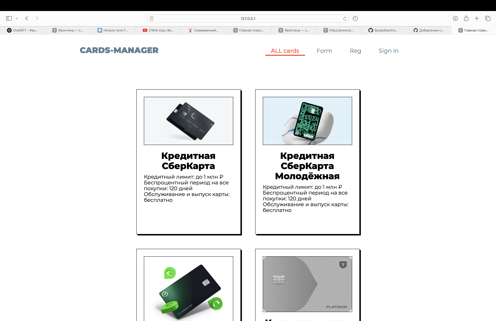

# HACK-MAI-T1
Простое веб-приложение для отображения текущей погоды в разных городах.

Простой сайт, созданный для хахатона от МАИ и компании Т1. Этот проект показывает только frontend-часть всего проекта, поэтомы вы можете заметить большое количество загрлушек и фейк ответов от бекенда.

Сама идея сайта в том что вы после регистрации получаете доступ к анкете, пройдя которую вы получите подходящие вам карты из нашей базы карт. Дальше вы будете перенаправлены в иторию, где сможете посмотреть результаты ваших прошлых анкет.

## 📌 Функционал
- Регистрация и вход в аккунт
- История

## 🚀 Запуск проекта
1. Склонировать репозиторий

2. Открыть файл `index.html` в браузере используя Live Server

## 🛠 Используемые технологии
- HTML, CSS, JavaScript

## ✉️ Контакты
Email: marseg06@mail.ru

 
